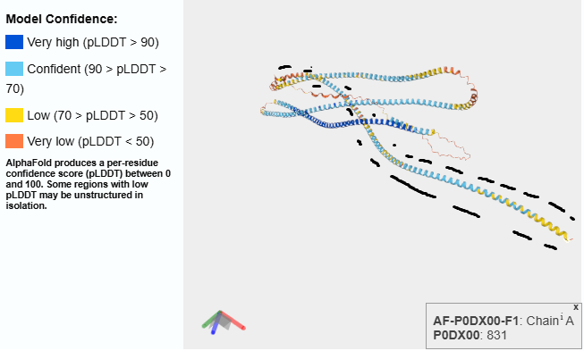
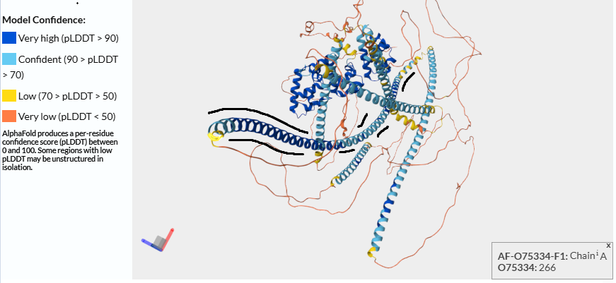
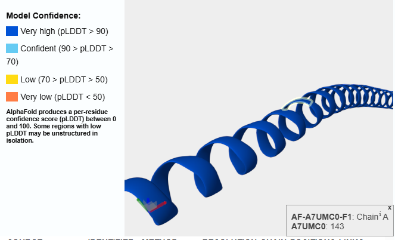
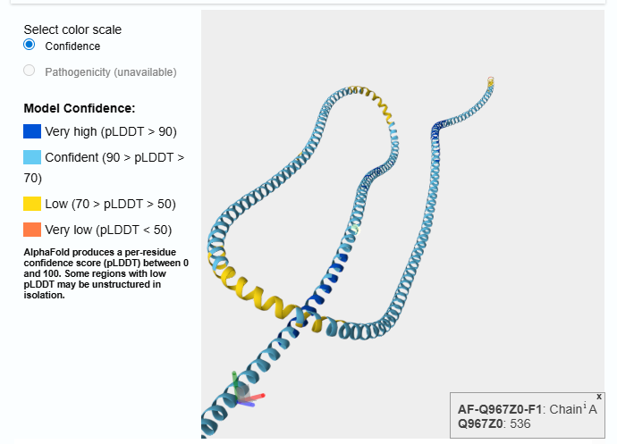

## Datasets

### Model Organisms

In this study, we utilized *E. coli* and *H. sapiens* as model organisms, representing prokaryotic and eukaryotic proteomes respectively. *SwissProt* was used as a comprehensive database, providing a reference due to its high-quality, manually curated entries. To ensure computational stability and avoid Out-Of-Memory (OOM) errors during ProtBert processing, all sequences exceeding 2500 amino acids were removed. 

#### Dataset Summary

| Organism     |   Total Sequences |   Processed (<2500aa) |
|:-------------|------------------:|----------------------:|
| *E. coli*    |              4403 |                  4362 |
| *H. sapiens* |             20659 |                 20586 |
| *SwissProt*  |            574627 |                486337 |

#### Percentage of disorder 

| Species    |   Disorder_Pct |   Helix_Pct |   Strand_Pct |   Coil_Pct |
|:-----------|---------------:|------------:|-------------:|-----------:|
| E. coli    |           5.1  |       42.77 |        16.46 |      40.77 |
| H. sapiens |          25.42 |       27.69 |         9.7  |      62.61 |
| SwissProt  |          12.32 |       35.5  |        14.32 |      50.19 |

> Remark: Difference in *Disorder_Pct* is expected. Eukarya should have higher disorder ($\approx 30%-40%$ [Wikipedia](https://en.wikipedia.org/wiki/Intrinsically_disordered_proteins)) than eubacterial ($\approx 4\%$). 

## Computational Performance

### Resource Scaling and Intuition

The primary objective was to investigate how processing time and memory usage scales with sequence length and organism type. By analyzing these metrics, we aim to build intuition for resource estimation. 

To obtain best results before running model i were moving every part of samples to RAM memory (`/dev/shm/`) using `run_on_ram.sh` script. I also measured does prediction time scales lineary with sequence length.

#### Time estimation results

| Experiment_ID          |   Total Sequences |   Avg Length [aa] |   Avg Time/Seq [s] |   Avg Time/AA [ms] |   Avg Memory [MB] |   Max Memory [MB] |   Correlation |   Human Proteome Est (20k prot) [h] |
|:-----------------------|------------------:|------------------:|-------------------:|-------------------:|------------------:|------------------:|--------------:|------------------------------------:|
| ProtBert-E-coli-cpu    |               362 |            298.83 |             1.9875 |               7.13 |              0    |              0    |        0.9916 |                               11.04 |
| ProtBert-E-coli-gpu    |               362 |            298.83 |             0.0427 |               0.21 |           1641.74 |           1644.76 |        0.5701 |                                0.24 |
| ProtBert-H-sapiens-gpu |               586 |            550.37 |             0.0704 |               0.15 |           1715.25 |           1717    |        0.989  |                                0.39 |
| ProtBert-SwissProt-cpu |               337 |            359.14 |             2.4462 |               8.13 |              0    |              0    |        0.5069 |                               13.59 |
| ProtBert-SwissProt-gpu |               337 |            359.14 |             0.0486 |               0.19 |           1713.09 |           1717    |        0.9417 |                                0.27 |
| iupred-E-coli-long     |               362 |            298.83 |             0.008  |               0.03 |             12.23 |             12.26 |        0.9919 |                                0.04 |
| iupred-E-coli-short    |               362 |            298.83 |             0.0054 |               0.02 |             12.22 |             12.25 |        0.9745 |                                0.03 |
| iupred-H-sapiens-long  |               586 |            550.37 |             0.0133 |               0.03 |             12.53 |             12.57 |        0.9983 |                                0.07 |
| iupred-H-sapiens-short |               586 |            550.37 |             0.0088 |               0.02 |             12.53 |             12.57 |        0.9799 |                                0.05 |
| iupred-SwissProt-long  |               337 |            359.14 |             0.0104 |               0.03 |             12.28 |             12.56 |        0.9947 |                                0.06 |
| iupred-SwissProt-short |               337 |            359.14 |             0.0068 |               0.02 |             12.28 |             12.56 |        0.9926 |                                0.04 |

#### Total Execution Time

In following *table: Total Execution Time* calculated times are caluclated by substracting from final start time. Loading model was taking $\approx 0.2-0.5\mathrm{s}$ where predicting one part was taking $\approx 11-15\mathrm{s}$. Taking that into consideration our times fir GPU (ProtBert) are inflated by $1\% - 4.5\%$.

| Organism     |   IUPred Short [min] |   IUPred Long [min] |   ProtBert [min] |   Total [min] |
|:-------------|---------------------:|--------------------:|-----------------:|--------------:|
| *E. coli*    |                 0.37 |                0.75 |             1.4  |          2.52 |
| *H. sapiens* |                 2.4  |                6.2  |             9.2  |         17.8  |
| *SwissProt*  |               111.5  |              109.3  |           150.87 |        371.67 |
| **Total**    |               114.27 |              116.25 |           161.47 |        391.99 |

#### Performance Analysis

From *Table: Time Estimation* we can see that using CPU instead of GPU takes $\approx 50$ times more time. *ProtBert-H-sapiens-gpu* is not included, because i were obtaining error during training, it can be caused by some specific sequence . Later i predict training set using GPU. 

From memory usage we can conclude that memory was mostly used by *ProtBert* model, as we can see from differance between *Max Memory* and *Mean Memory* most memory were occupied my model weights, not sequences. Because of that, we could create partitions with more samples because 

## Model Validation against DisProt

### Comparative Study of IUPred Versions

We aimed to determine whether the 'short' or 'long' version of IUPred provides a more accurate representation of intrinsically disordered regions in human proteins. To evaluate performance, we utilized the Matthews Correlation Coefficient (MCC) against experimentally validated fragments from DisProt. MCC was chosen because it provides good measure for binary classification with disbalanced classes.

#### MCC Validation Results

| File               |    MCC |
|:-------------------|-------:|
| iupred_short.fasta | 0.2867 |
| iupred_long.fasta  | 0.2937 |

#### Comparison Analysis

Based on the *Table: MCC Validation Results*, the IUPred *long* version achieved a higher performance score ($0.2937$) compared to the *short* version ($0.2867$). This suggests that the human proteome is characterized more by global disorder rather than localized flexible segments. The long version's physical model utilizes a broader window for estimating pairwise energy, allowing it to identify large disordered domains ($>30$ residues) that lack sufficient stabilizing inter-residue interactions. In contrast, the short version is optimized for smaller loops and terminal flexibility by applying different parameters to the energy estimation near protein ends. The MCC of the long model indicates that many human intrinsically disordered regions (IDRs) function as expansive, flexible scaffolds rather than just terminal extensions. 

## Identification of Functional Transitions

### Search for Induced Fit Regions

We aimed to identify disordered regions that undergo structural transitions upon binding, known as induced fit, by contrasting IUPred’s energy-based disorder predictions with ProtBert’s secondary structure propensities. We specifically isolate 'conflicting' fragments—predicted as disordered by IUPred but assigned high structural confidence (helices or strands) by ProtBert to pinpoint potential Molecular Recognition Features (MoRFs). This approach is justified by the hypothesis that these regions possess a latent structural preference that only manifests upon contact with a binding partner, distinguishing functional interaction sites from permanently disordered segments.

$$IndDis-score = (2 \cdot H) + (2 \cdot E) - (4 \cdot -)$$

#### Top Candidates (Induced Fit)

| UID    | Fragment   |   IndDis_Score |   H_cnt |   E_cnt |   C_cnt |
|:-------|:-----------|---------------:|--------:|--------:|--------:|
| P0DX00 | 584-832    |            384 |     230 |       0 |      19 |
| H0YM25 | 612-854    |            372 |     224 |       0 |      19 |
| O75334 | 293-473    |            350 |     179 |       0 |       2 |
| P30622 | 972-1135   |            328 |     164 |       0 |       0 |
| Q14683 | 240-414    |            284 |     164 |       0 |      11 |

#### Analysis

From *Table: Top Candidates (Induced Fit)* we obtain two completly different results. One from IUPred which is based on energy (odziłaywań) between amino acids and ProtBert which is probabilistic based on many proteins of those types. What is important it indicates that in many proteins those regions are stable despite physical forces which indicates that (że najprawdopoobniej zachodzą tutaj stabilne wiązania pomiędzy różnymi typami białkami, a poza tym są niestabilne)

The results presented in the *Table: Top Candidates (Induced Fit)* table highlight a significant divergence between energy-based and probabilistic prediction models. IUPred, which operates on a thermodynamic scale by estimating pairwise inter-residue interaction energies, classifies these regions as intrinsically disordered. This suggests that, in isolation, these fragments lack sufficient stabilizing energy to maintain a folded state

In contrast, ProtBert and AlphaFold (images) both utilizing probabilistic patterns derived from evolutionary and structural datasets, assign these fragments high structural propensity, specifically as alpha-helices. 

The difference in these predictions stems from the protein's environment. IUPred analyzes the protein in isolation, identifying these regions as unstable and disordered. However, ProtBert and AlphaFold predict a stable structure because these segments become ordered when bound to partner proteins or positioned within a larger complex. This transition—from a disordered monomer to an ordered state upon interaction—explains the divergent results.

The above AlphaFold visualizations for proteins *P0DX00* and *O75334* provide a clear illustration of this phenomenon. The IUPred fragments (encircled in black) are rendered as long alpha-helices.

## Discovery of Helical Scaffolds

### Identification of Super-Helical Proteins

We performed screening of the SwissProt database to identify proteins with exceptional alpha-helical content. By applying the SHS-score, we strictly filter for sequences that maximize helical propensity while penalizing coils and strands. 

$$SHS-score = \frac{[2 \cdot H + (-1) \cdot - + (-2) \cdot E]}{len(seq)}$$

#### Top Candidates (SwissProt)

| UID    |   SHS_Score |   H_pct |   E_pct |   Length |
|:-------|------------:|--------:|--------:|---------:|
| Q967Z0 |      1.9855 |   99.28 |       0 |      692 |
| P41114 |      1.9752 |   98.76 |       0 |      242 |
| A7UMC0 |      1.9718 |   98.59 |       0 |      284 |
| O02389 |      1.9648 |   98.24 |       0 |      284 |
| Q9GZ69 |      1.9648 |   98.24 |       0 |      284 |

#### Conclusion

Proteins with highest scores are:
- *Q967Z0* - *Paramyosin* - major structural component of many thick filaments isolated from invertebrate muscles.
- from second to fourth are *Tropomyosin*, which plays plays a central role in the calcium dependent regulation of muscle contraction

Images shows visualization of those proteins which are just long alpha-helix.